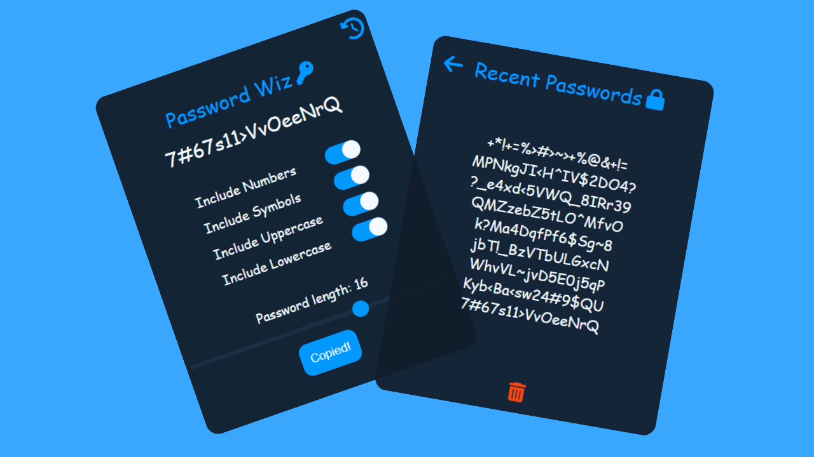

# Password Generator Chrome Extension

This is a Chrome extension that generates passwords of varying lengths and displays the last 10 generated passwords.

## Features

- Generates passwords from 8-20 characters
- Displays the last 10 generated passwords
- Easy-to-use interface
- Secure and reliable password generation

## Installation

To install the Password Generator Chrome Extension, follow these steps:

1. Download the extension from the Chrome Web Store or GitHub
2. Unzip the downloaded file (if necessary)
3. Open Chrome and navigate to the Extensions settings (chrome://extensions/)
4. Enable Developer Mode in the top right corner
5. Click on the "Load unpacked" button in the top left corner
6. Navigate to the unzipped folder and select it

The Password Generator Chrome Extension should now be installed and ready to use.

## Usage

To use the Password Generator Chrome Extension, click on the extension icon in the toolbar. This will open the password generator interface.

To generate a password, select the desired length using the dropdown menu and click the "Generate" button. The generated password will appear in the text box. The password will be copied automatically in your clip.

The last 10 generated passwords are displayed in the "Htstory" button on the top right corner.

## Contributing

If you find any bugs or have suggestions for improving the Password Generator Chrome Extension, please open an issue on GitHub or submit a pull request.

## License

This project is licensed under the MIT License - see the [LICENSE](LICENSE) file for details.
